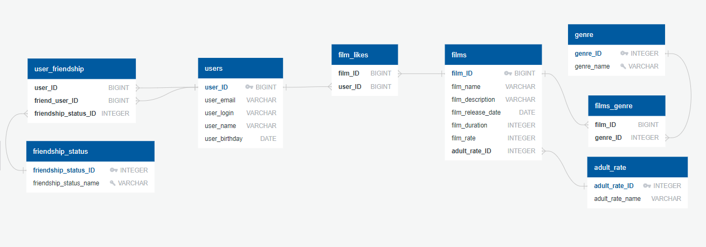

# java-filmorate
Template repository for Filmorate project.


<details>
    <summary>Запрос при добавлении/обновлении/получении фильма или добавления/удаления лайка к фильму</summary>
    ```sql
    SELECT f.film_id, 
           f.film_name, 
           f.film_description, 
           f.film_release_date, 
           f.film_duration, 
           f.film_rate, 
           g.genre_name, 
           ar.adult_rate_name, 
           fl.user_id AS liked_user 
    FROM film AS f 
    LEFT OUTER JOIN films_genre AS fg ON fg.film_id = f.film_id 
    LEFT OUTER JOIN genre AS g ON g.genre_id = fg.genre_id
    LEFT OUTER JOIN adult_rate AS ar ON ar.adult_rate_id = f.adult_rate_id
    LEFT OUTER JOIN film_likes AS fl ON fl.film_id = f.film_id
    WHERE f.film_id = /*ID фильма*/;
    ```
</details>
<details>
    <summary>Запрос при получении всех фильмов</summary>
    ```sql
    SELECT f.film_id,
           f.film_name,
           f.film_description,
           f.film_release_date,
           f.film_duration,
           f.film_rate,
           g.genre_name,
           ar.adult_rate_name,
           fl.user_id AS liked_user 
    FROM film AS f 
    LEFT OUTER JOIN films_genre AS fg ON fg.film_id = f.film_id
    LEFT OUTER JOIN genre AS g ON g.genre_id = fg.genre_id 
    LEFT OUTER JOIN adult_rate AS ar ON ar.adult_rate_id = f.adult_rate_id 
    LEFT OUTER JOIN film_likes AS fl ON fl.film_id = f.film_id;
    ```
</details>
<details>
    <summary>Запрос на получение наиболее популярных фильмов в количестве</summary>
    ```sql
    SELECT f.film_id,
           f.film_name,
           f.film_description,
           f.film_release_date,
           f.film_duration,
           f.film_rate,
           g.genre_name,
           ar.adult_rate_name,
           fl.user_id AS liked_user
    FROM film AS f 
    LEFT OUTER JOIN films_genre AS fg ON fg.film_id = f.film_id
    LEFT OUTER JOIN genre AS g ON g.genre_id = fg.genre_id
    LEFT OUTER JOIN adult_rate AS ar ON ar.adult_rate_id = f.adult_rate_id
    LEFT OUTER JOIN film_likes AS fl ON fl.film_id = f.film_id
    GROUP BY f.film_id, 
             f.film_name, 
             f.film_description, 
             f.film_release_date, 
             f.film_duration, 
             f.film_rate, 
             ar.adult_rate_name, 
             fl.user_id AS liked_user
    ORDER BY COUNT(liked_user) 
    LIMIT /*полученное ограничение, если его нет то 10*/;
    ```
</details>
<details>
    <summary>Запрос при добавлении/обновлении/получении пользователя или добавления/удаления друга</summary>
    ```sql
    SELECT u.*,
           uf.friend_user_id,
           fs.friendship_status_name 
    FROM user AS u 
    LEFT OUTER JOIN user_friendship AS uf ON uf.user_id = u.user_id
    LEFT OUTER JOIN friendship_status AS fs ON fs.friendship_status_id = uf.friendship_status_id
    WHERE u.user_id = ID пользователя;
    ```
</details>
<details>
    <summary>Запрос на получение всех пользователей</summary>
    ```sql
    SELECT u.*,
           uf.friend_user_id,
           fs.friendship_status_name 
    FROM user AS u 
    LEFT OUTER JOIN user_friendship AS uf ON uf.user_id = u.user_id 
    LEFT OUTER JOIN friendship_status AS fs ON fs.friendship_status_id = uf.friendship_status_id;
    ```
</details>
<details>
    <summary>Запрос на получение друзей</summary>
    ```sql
    SELECT u.*,
           ufr.friend_user_id,
           fs.friendship_status_name 
    FROM user AS u LEFT OUTER JOIN user_friendship AS ufr ON ufr.user_id = u.user_id
    LEFT OUTER JOIN friendship_status AS fs ON fs.friendship_status_id = ufr.friendship_status_id
    WHERE u.user_id IN (SELECT uf.friend_user_id 
                        FROM user_friendship AS uf 
                        WHERE uf.user_id = /*ID пользователя, чьих друзей мы ищем*/);
    ```
</details>
<details>
    <summary>Запрос на получение общих друзей</summary>
    ```sql
    SELECT u.*,
           uf.friend_user_id,
           fs.friendship_status_name 
    FROM user AS u 
    LEFT OUTER JOIN user_friendship AS uf ON uf.user_id = u.user_id 
    LEFT OUTER JOIN friendship_status AS fs ON fs.friendship_status_id = uf.friendship_status_id 
    WHERE u.user_id IN (SELECT uff.friend_user_id 
                        FROM user_friendship AS uff 
                        WHERE uff.user_id = /*ID первого пользователя/* 
                        INTERSECT 
                        SELECT ufs.friend_user_id 
                        FROM user_friendship AS ufs 
                        WHERE ufs.user_id = /*ID второго пользователя*/);
    ```
</details>